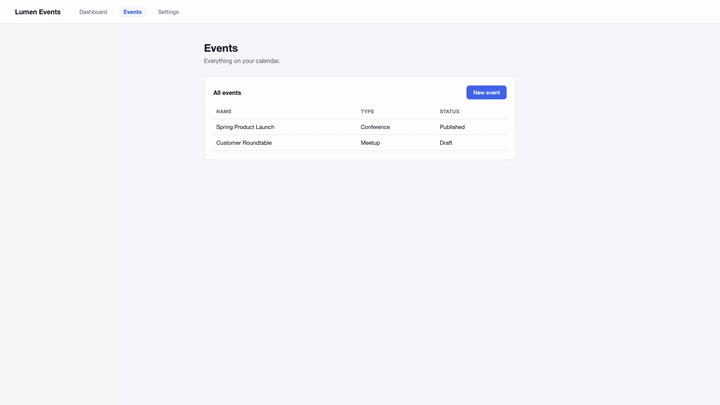

# tutorial-forge

[](https://www.npmjs.com/package/tutorial-forge)
[](https://github.com/jbrecht/tutorial-forge/actions/workflows/ci.yml)
[](COMMERCIAL.md)

Turn scripted Playwright walkthroughs into finished, narrated tutorial videos (MP4).



*Excerpt from the example app's generated tutorial — fake cursor, click highlights, and pacing all derive from the script below. [Watch the full video with narration](https://github.com/jbrecht/tutorial-forge/blob/main/docs/assets/getting-started.mp4).*

**Tutorials are source code.** Each tutorial is a TypeScript file pairing narration lines with raw Playwright actions. When your app's UI changes, you re-run the pipeline instead of re-recording. Tutorials live in your repo, get reviewed in PRs, and regenerate in CI.

```ts
import { tutorial, step } from 'tutorial-forge';

export default tutorial('Getting started', [
  step('Welcome! Let us create your first event.', async () => {}),
  step('Open the Events page from the navigation bar.', async (page) => {
    await page.getByRole('link', { name: 'Events' }).click();
  }),
  step('Click New event and fill in the details.', async (page) => {
    await page.getByRole('button', { name: 'New event' }).click();
    await page.getByLabel('Event name').fill('Summer Kickoff');
  }),
]);
```

```
$ tutorial-forge render
▶ getting-started — Getting started (3 steps)
✓ tutorials/dist/getting-started.mp4 (32.1s)
  subtitles: tutorials/dist/getting-started.srt
```

The pipeline handles everything else: TTS narration (ElevenLabs, OpenAI, Piper, or silent), browser driving, screen recording, narration-driven pacing, an animated fake cursor, click-highlight callouts, optional zoom toward click targets (`--zoom`), SRT subtitles, and the final FFmpeg merge.

**Localization built in:** drop a `getting-started.tutorial.es.json` translation file next to the tutorial and run `tutorial-forge render --lang es` — same walkthrough, Spanish narration and subtitles, pacing re-derived from the actual Spanish speech. Every language your docs need, regenerated on every release. See [writing tutorials](docs/writing-tutorials.md#localization).

## How it works

```
┌─────────────┐      ┌─────────────┐      ┌─────────────┐
│   1. TTS    │ ───▶ │  2. RECORD  │ ───▶ │   3. POST   │
└─────────────┘      └─────────────┘      └─────────────┘
  audio files          raw .webm +          final .mp4
  + durations          manifest.json        (+ .srt)
```

1. **TTS** — every narration line is synthesized and measured first (content-hash cached, so unchanged lines are never re-synthesized).
2. **Record** — Chromium is driven through your steps while Playwright records video. Each step holds on screen at least as long as its narration clip: narration drives pacing, never the reverse.
3. **Post** — one FFmpeg invocation trims setup pre-roll, lays each narration clip at its measured offset, downscales, and transcodes to H.264/AAC.

Every stage writes inspectable artifacts to a work directory (`.forge/<id>/`), kept on failure. Phases re-run independently: `tutorial-forge render --phase post` re-merges without re-recording.

**Authoring loop.** Two helpers tighten the iterate-on-one-step cycle:

- `tutorial-forge preview <step>` renders a single step to a PNG in seconds — it replays setup + prior steps to reach state, then runs just the target step (by 1-based index or step id) and screenshots it. No TTS, no encode. Validate selectors and framing without re-recording the whole tutorial.
- `tutorial-forge render --contact-sheet` emits a labeled grid PNG (one settled thumbnail per step) next to the video. A passing render only proves selectors *resolved* — the contact sheet lets you confirm every step framed the *right* thing at a glance.

## How it compares

- **[playwright-recast](https://github.com/ThePatriczek/playwright-recast)** is the closest open-source neighbor: it post-processes recordings of your existing Playwright *tests* into videos, fitting voiceover onto the recording by retiming it. tutorial-forge inverts that relationship — narration is synthesized and measured *first*, and the browser holds each step on screen live until its line finishes, so pacing always feels deliberate. You also author tutorials as dedicated specs (with an adapter that seeds app state) rather than reusing tests. If you want videos from tests you already have, recast is a great fit; if you want to author tutorials as a first-class artifact, that's what this is for.
- **Recording-based SaaS** (Videate, Guidde, Clueso, Arcade, Supademo) solves the same staleness problem starting from screen captures, with editors and hosting on top. tutorial-forge is the code-native, open-source take: tutorials live in your repo, are reviewed in PRs, and regenerate in CI — no recording step exists at all.
- **[Remotion](https://remotion.dev)** is programmatic video as a React framework — a substrate you could build a pipeline like this on, not a tutorial tool itself.
- **[VHS](https://github.com/charmbracelet/vhs)** does tapes-as-code for *terminal* recordings. tutorial-forge is the same philosophy pointed at web apps, with narration.

## Requirements

- Node ≥ 20, `ffmpeg`/`ffprobe` ≥ 6 on PATH, Playwright Chromium (`npx playwright install chromium`)
- Check your environment with `tutorial-forge doctor` — it verifies the toolchain above and, when run from a project, probes that the app at your adapter's `baseURL` is reachable

## Packages

| Package | What |
|---|---|
| `packages/core` (`tutorial-forge`) | The library: types, spec builders, pipeline, TTS providers |
| `packages/cli` (`tutorial-forge-cli`) | `tutorial-forge render / preview / list / doctor / clean` (alias: `tforge`) |
| `packages/example-app` | Self-contained demo app + tutorial; the dev/CI target |

## Quick start (this repo)

```sh
pnpm install
pnpm --filter tutorial-forge build
cd packages/example-app
pnpm exec playwright install chromium
pnpm serve &          # demo app on :4173
pnpm forge render     # → tutorials/dist/getting-started.mp4
```

By default the example renders with silent placeholder narration. For real voices, copy `.env.example` to `.env` in `packages/example-app`, set `FORGE_TTS=elevenlabs` (with `ELEVENLABS_API_KEY`) or `FORGE_TTS=openai` (with `OPENAI_API_KEY`), and re-run. The CLI loads `.env` from the directory you run it in; `.env` is gitignored. See [getting started](docs/getting-started.md#tts-providers-and-api-keys) for creating a minimally-scoped ElevenLabs key (only "Text to Speech" access is needed).

Docs: [getting started](docs/getting-started.md) · [writing tutorials](docs/writing-tutorials.md) · [adapters](docs/adapters.md)

## License

Tutorial Forge is licensed under the [PolyForm Small Business License 1.0.0](LICENSE) — a source-available license.

Free for individuals and organizations under **100 people and $1M USD revenue** (including CI/CD and hosted-service use — size is the only gate). Larger organizations require a commercial license; see [COMMERCIAL.md](COMMERCIAL.md).
